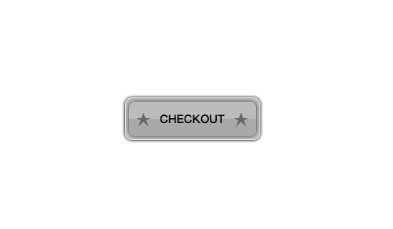

# CSS按钮带五角星



[在线演示](https://codepen.io/luofatso/pen/YzedQdK)

```
<!DOCTYPE html>
<html lang="en">
  <head>
    <meta charset="UTF-8" />
    <meta name="viewport" content="width=device-width, initial-scale=1.0" />
    <title>按钮</title>
    <style>
      * {
        margin: 0;
        padding: 0;
      }

      .btn-box {
        width: 190px;
        padding: 5px;
        height: 60px;
        border-radius: 10px;
        background-color: #cbcbcb;
        box-shadow: 0 0 4px #000;
        border: 1px solid #fff;
        box-sizing: border-box;
        display: flex;
        align-items: center;
        justify-content: center;
        position: absolute;
        left: 50%;
        top: 50%;
        transform: translate(-50%, -50%);
      }

      .content {
        width: 100%;
        height: 100%;
        display: flex;
        align-items: center;
        justify-content: space-between;
        padding: 0 10px;
        font-weight: bold;
        box-shadow: 0 0 5px #555;
        border-radius: 8px;
        position: relative;
        z-index: 2;
        overflow: hidden;
        /* background: linear-gradient(#CBCBCB, #bbb); */
      }

      .content span {
        position: relative;
        z-index: 2;
      }

      .content::after {
        content: '';
        width: 100%;
        height: 50%;
        position: absolute;
        bottom: 0;
        left: 0;
        background-color: #bbb;
        z-index: 1;
      }

      .star-five {
        border-color: #7d7d7d transparent transparent transparent;
        border-style: solid;
        border-top-width: 5px;
        border-right-width: 10px;
        border-left-width: 10px;
        height: 0;
        margin-top: 9px;
        margin-bottom: 3.21429px;
        position: relative;
        width: 0;
        z-index: 2;
      }

      .star-five:before,
      .star-five:after {
        border-color: #7d7d7d transparent transparent transparent;
        border-style: solid;
        border-top-width: 5px;
        border-right-width: 10px;
        border-left-width: 10px;
        content: '';
        display: block;
        height: 0;
        left: -10px;
        position: absolute;
        top: -5px;
        width: 0;
      }

      .star-five:before {
        transform: rotate(70deg);
      }

      .star-five:after {
        transform: rotate(-70deg);
      }
    </style>
  </head>

  <body>
    <div class="btn-box">
      <div class="content">
        <div class="star-five"></div>
        <span>CHECKOUT</span>
        <div class="star-five"></div>
      </div>
    </div>
  </body>
</html>
```
