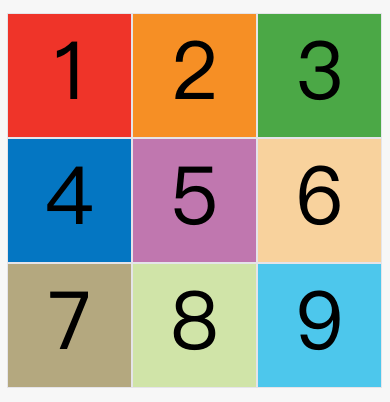
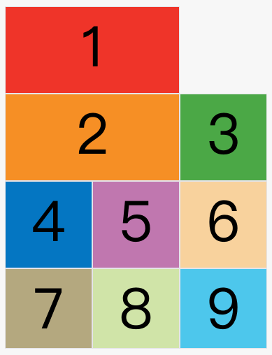
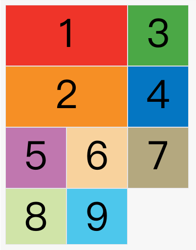
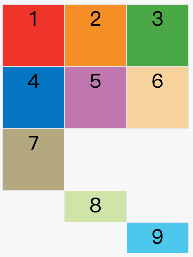

# Grid布局示例

采用网格布局的区域，称为"容器"（container）。容器内部采用网格定位的子元素，称为"项目"（item）。
## 1. 容器


### 1.1 display属性
```
display: grid;
display: inline-grid;
```

### 1.2 grid-template-columns 属性，grid-template-rows 属性

容器指定了网格布局以后，接着就要划分行和列。`grid-template-columns`属性定义每一列的列宽，`grid-template-rows`属性定义每一行的行高。

> repeat(num:重复数量, number:重复数值) num为关键字`auto-fill`关键字时，为`number`值尽可能多表示。
> fr关键字；剩下的倍数划分的意思，类似flex：1；
> minmax(min, max),接受两个参数，分别为最小值和最大值。取值在两者之间。
> auto关键字；浏览器自动分配。
> 网格线的名称 ` grid-template-columns: [c1] 100px [c2] 100px [c3] auto [c4]; grid-template-rows: [r1] 100px [r2] 100px [r3] auto [r4];`; 允许同一根线有多个名字，比如 `[fifth-line row-5]`。


### 1.3 row-gap, columns-gap, gap属性

分别为行间距，列间距，合并写法: `gap: row columns`; 省略只有一个值的时候为两个值一样。

### 1.4 grid-template-areas 属性

```
grid-template-areas: "header header header"
                     "main main sidebar"
                     "footer footer footer";
```


### 1.5 grid-auto-flow 属性


默认排版是先行后列（上图），可以采用先列后行（下图），类似flex的columns, `grid-auto-flow: column;`;

但是有时候列或者行的大小会很大，这样就会占用留下空白（上图），所以我们可以使用 `grid-auto-flow: column dense`;这样就会填充空白（下图），行出现留白一样的处理方式`grid-auto-flow: row dense`。


### 1.6 justify-items，align-items, place-items 属性

justify-items属性设置单元格内容的水平位置（左中右），align-items属性设置单元格内容的垂直位置（上中下）。

```
justify-items: start | end | center | stretch(拉伸，占满单元格的整个宽度（默认值）。);
align-items: start | end | center | stretch;
```

### 1.7 justify-content，align-content，place-content 属性

justify-content属性是整个内容区域在容器里面的水平位置（左中右），align-content属性是整个内容区域的垂直位置（上中下）。

```
justify-content: 
            start |
            end | 
            center | 
            stretch | 
            space-around(每个项目两侧的间隔相等。所以，项目之间的间隔比项目与容器边框的间隔大一倍。) | 
            space-between(space-between - 项目与项目的间隔相等，项目与容器边框之间没有间隔。) | 
            space-evenly(space-evenly - 项目与项目的间隔相等，项目与容器边框之间也是同样长度的间隔。);
align-content: start | end | center | stretch | space-around | space-between | space-evenly; 
```

### 1.8 grid-auto-columns, grid-auto-rows 属性

有时候，一些项目的指定位置，在现有网格的外部。比如网格只有3列，但是某一个项目指定在第5行。这时，浏览器会自动生成多余的网格，以便放置项目。



### 1.9 grid-template, grid 属性

grid-template属性是grid-template-columns、grid-template-rows和grid-template-areas这三个属性的合并简写形式。

grid属性是grid-template-rows、grid-template-columns、grid-template-areas、 grid-auto-rows、grid-auto-columns、grid-auto-flow这六个属性的合并简写形式。

从易读易写的角度考虑，还是建议不要合并属性。

## 2. 项目

### 2.1 grid-column-start, grid-column-end, grid-row-start, grid-row-end === grid-column, grid-row === grid-area

后面相等的为简写。

```
grid-column-start属性：左边框所在的垂直网格线
grid-column-end属性：右边框所在的垂直网格线
grid-row-start属性：上边框所在的水平网格线
grid-row-end属性：下边框所在的水平网格线
grid-column: <start-line> / <end-line>;
grid-row: <start-line> / <end-line>;
grid-area: <row-start> / <column-start> / <row-end> / <column-end>;
```

> 注意` grid-area `还可以为指定区域，例如指定为 grid-template-areas 属性上面设置的 `sidebar`

### 2.2 justify-self, align-self, place-self 属性

justify-self属性设置单元格内容的水平位置（左中右），跟justify-items属性的用法完全一致，但只作用于单个项目。

align-self属性设置单元格内容的垂直位置（上中下），跟align-items属性的用法完全一致，也是只作用于单个项目。


```
justify-self: start | end | center | stretch;
align-self: start | end | center | stretch;

start：对齐单元格的起始边缘。
end：对齐单元格的结束边缘。
center：单元格内部居中。
stretch：拉伸，占满单元格的整个宽度（默认值）。

place-self: <align-self> <justify-self>; 一个值是为两个相等
```

## 3拓展

[在线演示](https://codepen.io/luofatso/pen/wvyReNo)
[参考阮一峰 CSS Grid布局](http://ruanyifeng.com/blog/2019/03/grid-layout-tutorial.html)

```
<!DOCTYPE html>
<html lang="en">
  <head>
    <meta charset="UTF-8" />
    <meta name="viewport" content="width=device-width, initial-scale=1.0" />
    <meta http-equiv="X-UA-Compatible" content="ie=edge" />
    <title>Document</title>
    <style>
      .parent {
        height: 500px;
        display: grid;
        grid-template-columns: 3fr repeat(2, 1fr);
        grid-template-rows: repeat(5, 1fr);
      }

      .div1 {
        grid-area: 1 / 1 / 3 / 2;
        justify-se
      }

      .div2 {
        grid-area: 3 / 1 / 6 / 2;
      }

      .div3 {
        grid-area: 1 / 2 / 2 / 4;
      }

      .div4 {
        grid-area: 2 / 2 / 6 / 3;
      }

      .div5 {
        grid-area: 2 / 3 / 6 / 4;
      }

      div {
        border: 1px solid #000;
      }
    </style>
  </head>

  <body>
    <div class="parent">
      <div class="div1">
        <p>一些文字</p>
      </div>
      <div class="div2"></div>
      <div class="div3">3</div>
      <div class="div4">4</div>
      <div class="div5">5</div>
    </div>
  </body>
</html>

```