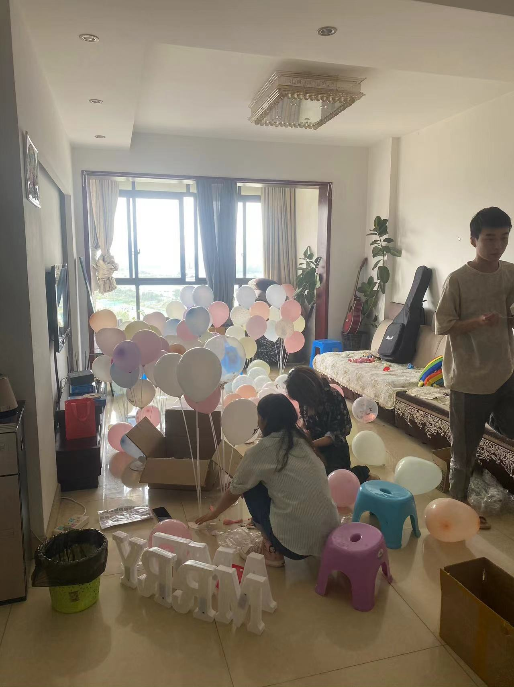
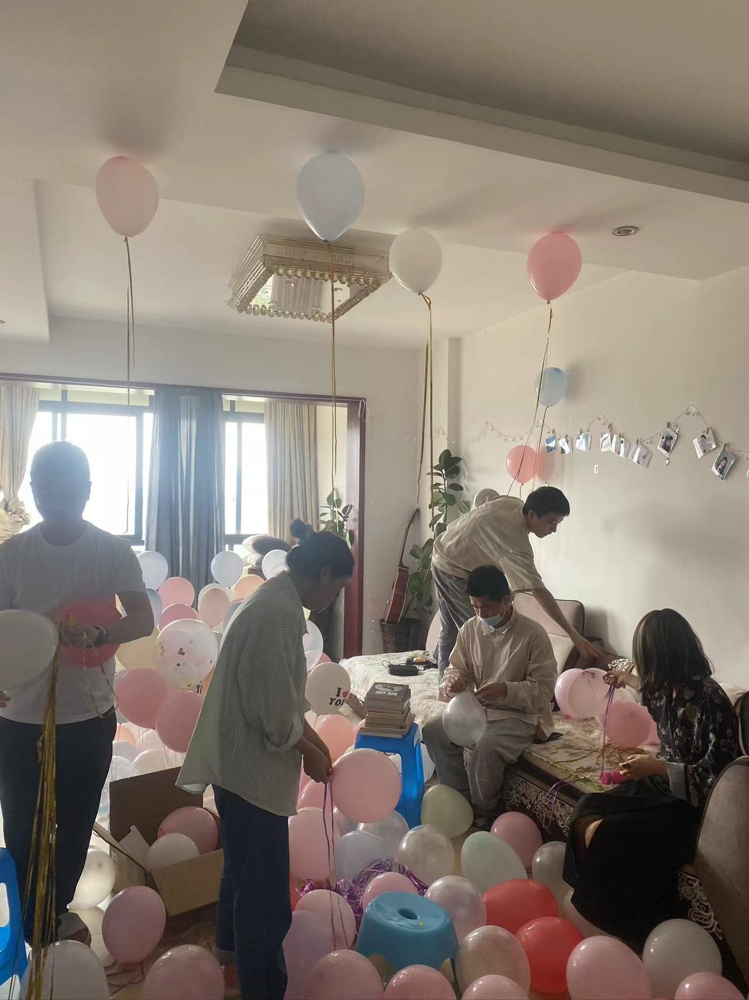
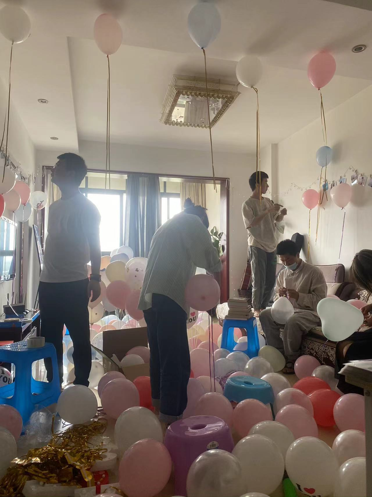
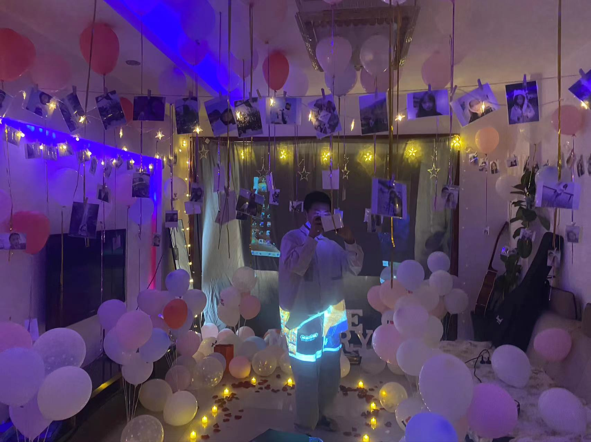
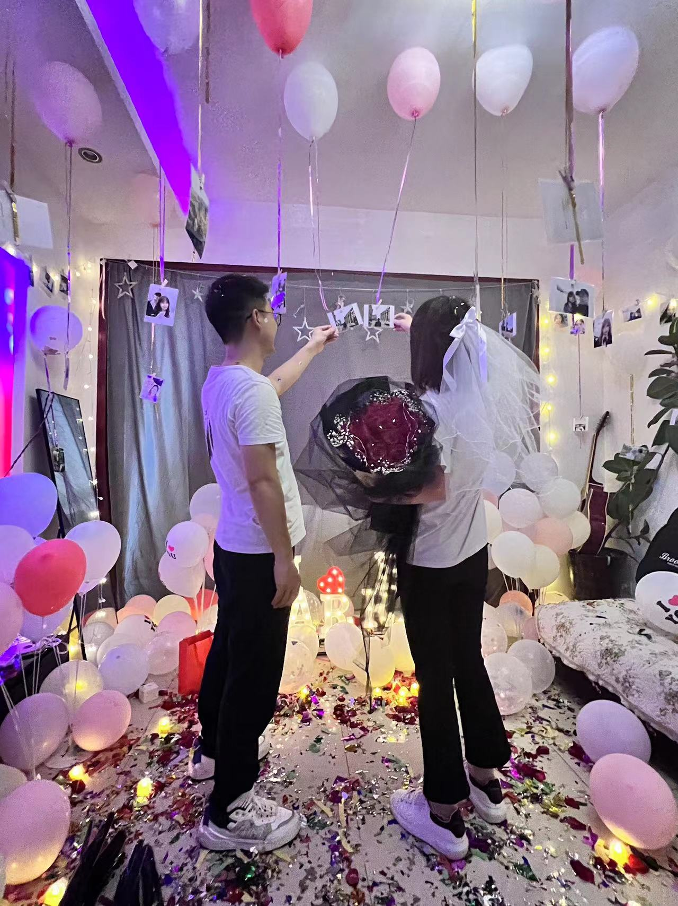
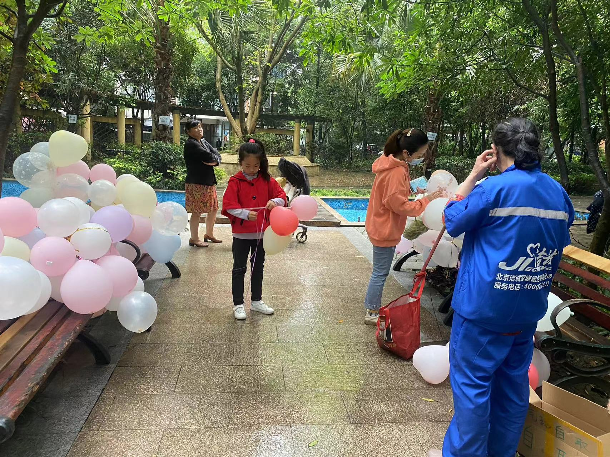
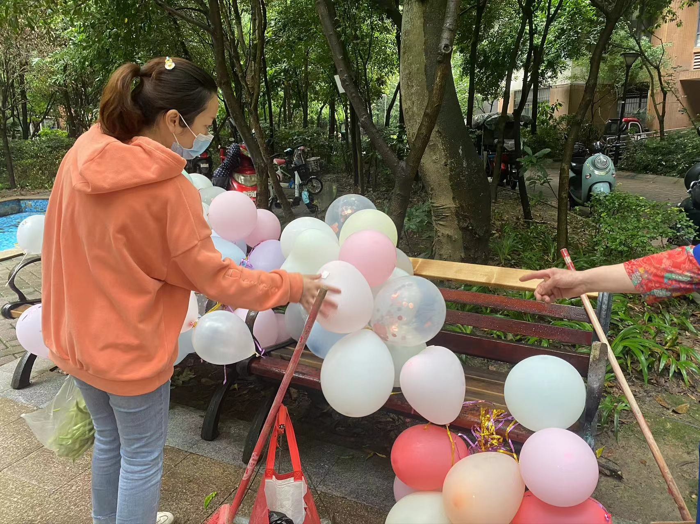
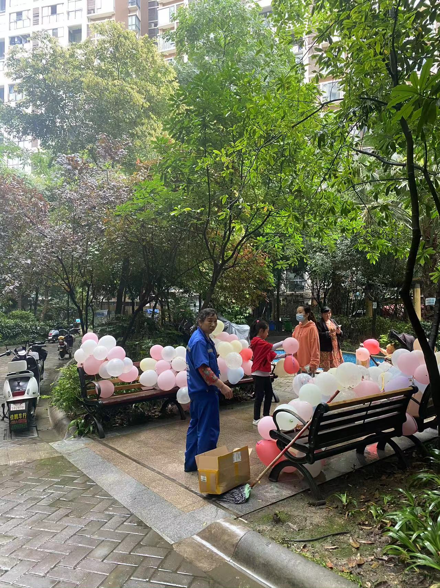

# 求婚

关于求婚的一些记录

## 小作文

相识九年，承蒙关照；

很庆幸在最美好的年华里有你的陪伴；

也很荣幸在这个物质横飞的年代，感受到你最真挚的爱情；

从XX年到现在，我们已经相识了X年；从XX年XX月XX日我们确定关系，到今天我们在一起XX天；从开始偷偷摸摸的网恋到现在的没有你睡不着的夜晚；如果问我什么是爱情的话，我想就是一起打一起闹，一起发脾气，一起旅行，一起上班，一起下班，一起做饭干饭，一起散步，一起骑行……跟你在一起的点点滴滴

很感谢宝宝你一直陪伴在我的身边，感谢生活工作中照顾的点点滴滴，感谢你没有放弃过我，一直陪伴陪伴着我;

~~不知道今天有没有给到你惊喜，不知道期间有没有叛徒，我估计你也知道一点;我怕给不了你惊喜，悄悄联系我能的好友，悄悄看东西，买东西，悄悄布置这一切，中间我也怕你不满意，但是对这一切我很用心，对于这一刻我迫不及待，~~

其实我不想成为大人，但是我更想爱你，让你成为我的小朋友；

我想倾其一生照顾，呵护，陪伴我面前的这个女孩；我知道来得太晚，你等待这一天很久了;这一刻我不想你再等了，我想给你一个家，从心动到古稀……

> 上面的‘小作文’其实提前很早就准备好了，自己也觉得熟记于心，不会出现任何的纰漏；但就是在这种关键的时刻，当时自己把自己给感动了————忘词！哈哈。

## 记录

对于这天我筹划了很久，我想她也是的期待了很久。

在一起生活了有几年了，东西不知不觉就多了很多，所以客厅平时的东西蛮多的，可以说更像杂物间:smile:；当时的客厅利用率真的很低，都是有朋友来才会在客厅😂。

准备工作做起来，先打气球和收拾杂物吧，感谢两位美女手都扎累。

关于这天我早早的就请好了假，悄悄和朋友筹划每一个环节，提前就联系我们的好友，购买一切所需物品；早上送完她上班后，先跑去拿回了提前订好的花束，然后开始了精心的布置每一个环节。

准备得差不多了，那就开始布置吧！先把彩灯围绕房间一圈，再把照片挂在彩灯上。

<table>
    <tr>
        <td> </td>
        <td></td>
    </tr>
</table>

一直怕自己布置得不是很好，怕留下遗憾；但是整个布置完下来的效果，真的很让人满意。朋友都说这是见过最好的求婚效果啦，我也是很是欣慰，因为这是自己亲自筹动手完成的。

布置好了，足足弄了一整整天。彩灯一开，音乐一放，那个氛围感蹭蹭的就起来了哈 :laughing: ,等待女主中。

其实有好多好多想说的，好多好多想记录的，但是好多好多都因为时间久远而模糊遗忘；有时候有好多好多的、美好的记忆在脑海一晃就过了，如果你不记录，有时候真的想破脑袋都很难想起。所以时常记录美好，是最好的选择。因为美好都需要精心经营。

求婚成功啦，非常感谢鬼子一起筹划，感谢所有朋友的见证和祝福！

感动和惊喜与浪漫都很不错，但收拾的时候也是真的难得收拾。

第二天我们把所有的气球都拴在了一起，用纸箱写了一个‘气球自取’，放在了小区的座椅上，因为昨晚下雨地面还没有怎么干透；最先拿走的居然是那个纸箱😂，后面看到很多小朋友都在自取哟，大概2小时就被拿完了，感觉这样挺不错的。

<table>
  <tr>
    <td></td>
    <td></td>
  </tr>
</table>

对呢，这个建议是何同学提的哟，我们一致觉得挺不错的建议。感谢何同学，送人玫瑰手留余香的建议。

当时点胶没有找到，我们用了强力胶和胶带，后面才发现撕胶带的时候总是吧墙面扯一块；我们也是了用热吹风，但是效果不是很理想，我想可能是我们时间太久的原因吧。后面再网上买的墙面修复膏，也就30几块也还能接受，只是修复上麻烦了点。

## 求婚购物清单

- 头纱，气氛大玻璃钻戒
  > 头纱很重要，我们是她闺蜜几个在电梯出口等，然后给她戴上
  > 这个憨憨，下电梯后，看见这么多人在等她，她都没有反应过来是什么原因，还以为都是来蹭饭的（保密工作很是好）
- 气球，彩带若干
  > 根据她喜欢的颜色，分别买了一些，总共得有300-400个的样子
  > 配合彩带，照片和彩灯，整个墙面和空间感就很不错
- 彩灯，路灯
  > 彩灯20、10米各一，5、2米若干，
  > 路灯(40个=两盒)进门到幕布前，配和花瓣零散的气球，地面就真的很不错
- 幕布(视频播放)
  > 简单用我们的一些照片做了一个小视频，加一些亲朋祝福小视频很不错的
- 麻绳（红毛线也不错）
  > 原计划是做一个照片墙的，后面照片，彩灯，麻绳结合使用的，效果也挺不错的
- 布置主背景墙
  > 除了自己准备一些布置的，我们还买了一个简单的求婚背景，主要就是‘marry me’几个英文大灯，配合我们单独买的路灯，很是融洽
- 玫瑰及花瓣  
  > 大把52朵，单支现场每人一支进场送女主，并说一句祝福语
  > 花瓣主要是用在路灯两边及求婚区
- 点胶，强力胶，挂钩
  > 一般买气球会送点胶，但是以防万一买了强力胶
  > 其实挂钩还是很好用的，配合麻绳可以想怎么挂彩灯或配置都不错哟
- 打印照片，小木夹子
  > 网上提起打印照片，我好像是打印了200张，
  > 小木夹好像是单独买的，很有感觉
- 手拧礼炮
  > 这玩意如果地面沾水了，打扫起来有点难搞
- 准备音响，话筒，投影仪，笔记本
  > 音响、投影仪这些是朋友的，单独买的话那就走远了
- 蛋糕
  > 晚餐蛋糕，提前预定，把气氛拉满
- 钻戒
  > 它来了，大冤种就是我。怎么说呢，这个主要还是看自己，对于价值来说我想大家都知道，反正出门就是垃圾的东西也没必要多说；反正我还是建议多和对方沟通，在对方的口里得到最真实的答案。对于我来说，是我自己想买，我不是看的物质的价值，也没有想着以后会卖（当然垃圾也不值钱），我是要的情感的价值，那人、那份、那刻、那以后的意义，只要对我自己有意义，所以它也不是垃圾，是另一种表现形式。

为了保密，我所有的购买清单都是走的好兄弟鬼子的账号；因为自己的手机看了相关的东西，淘宝京东都会推送相关的东西；所有到了的快递也全部让他帮忙签收，要想在当今社会做得悄悄咪咪还真有点难度。
