# 练车三连

这个季节还是比较想出去走走的，具体的目的地不重要，主要的还是想出去练一下车；拿驾照很多久了，但是基本就没有碰过车，可想而知该忘的不该忘的，基本上都忘得差不多了。这里记录连续三个周天出去练车、顺带散心的美好春光。

## 新津斑竹林

第一周我们去了新津的斑竹林，很久的第一次练车，所以宝宝没有一起去；有点可惜，想和她一起看遍这世间所有不一样的的风景。

很久没有开，一个人练习肯定是不敢的，叫了鬼子能给我提示。这个家伙第一次就怂恿我上高速，我还是比较怂，决定先熟悉熟悉感觉，走国道稳妥。

因为前面宝宝要准备PMP考试，一直努力做好她的后勤，春天的尾巴差点都没有给摸着，所以来一张途中快开谢的油菜花，作为补偿先压压惊一番。

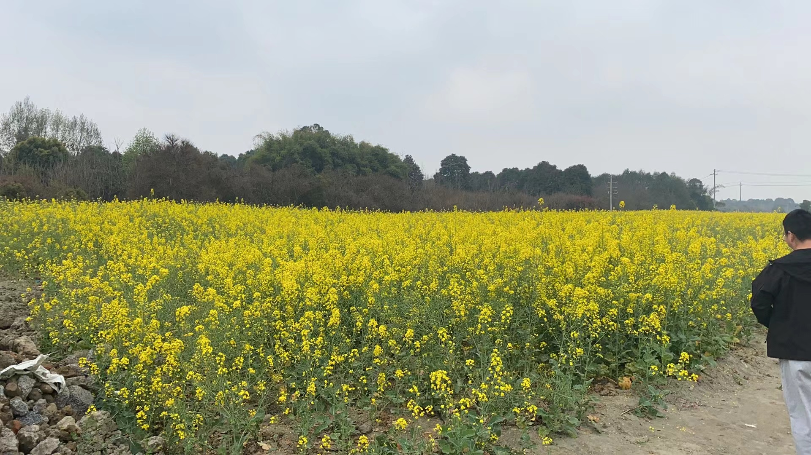

拍照技术有限，一直觉得都挺无所谓的；但是我今天突然回想，我是多久这样开始为自己找借口的呢，当年不会就闯的、就练习、就找找方法的我去哪里了？绝不能因为自己不是专业的，就不去了解、去钻研，还是要突破自己心低的防线，就不要心甘情愿当个不是专业，我觉得我心态需要多多调整一下。

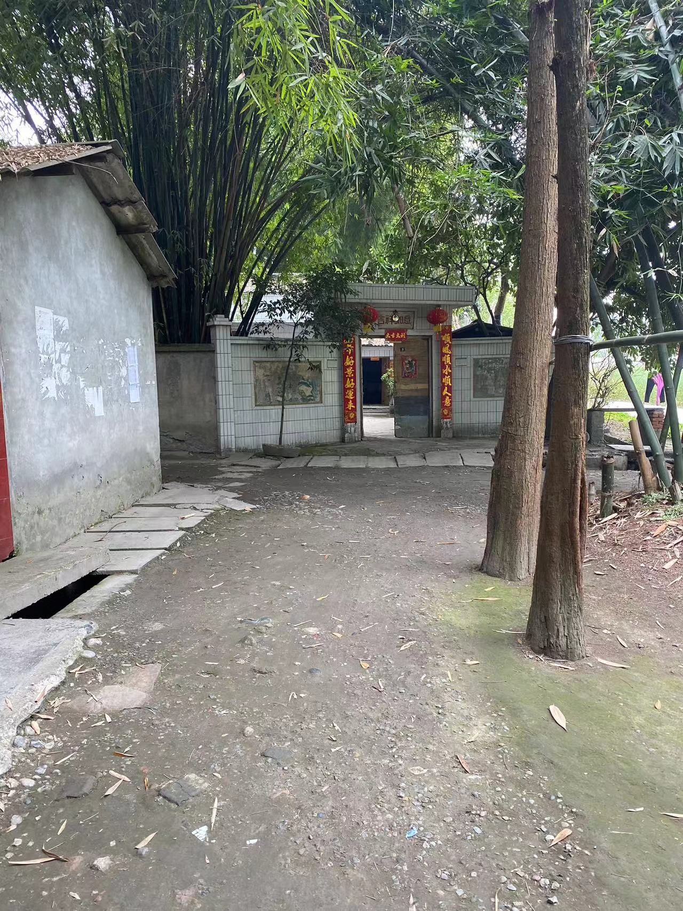

说实话斑竹林园区旁边，这个幽静的小农家还是挺不错的，有点出淤泥而不染的味道，抑或叫近朱者赤的感觉，也许这个就叫矗立在城市与林园的一种别具一格吧。

<table>
  <tr>
    <td> 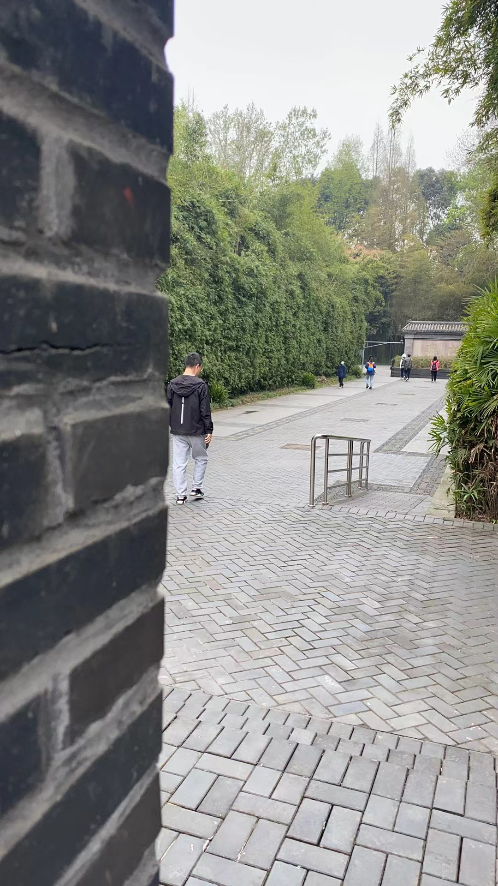</td>
    <td> 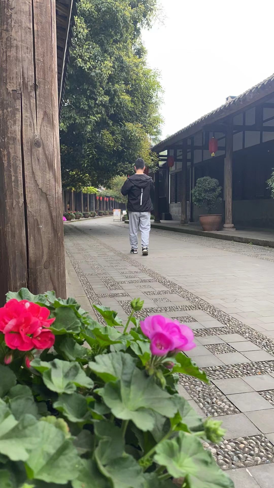</td>
  </tr>
</table>

新津斑竹林园区特点还是挺多的，林园建筑、幽静的竹林小路、彩色油菜花、骑行小道、大草坪的剧台、潺潺溪流、大湖泊、露营的营地等等；品类各式各样的都占一点，朴素、简单有种家的感觉，虽然是中规中矩普通的公园，但也别具一格，特别适合周末带小孩纸和老人散散心。

<table>
  <tr>
    <td> 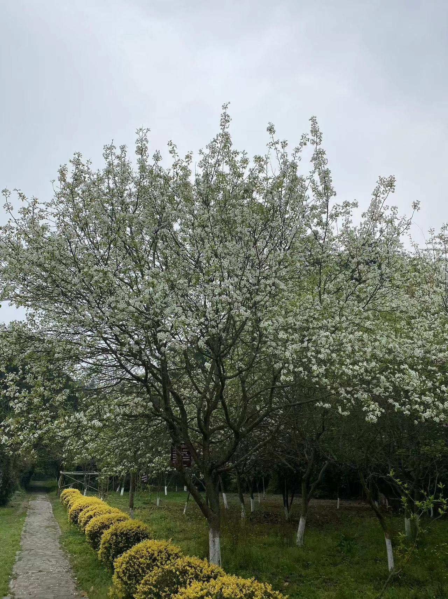</td>
    <td> 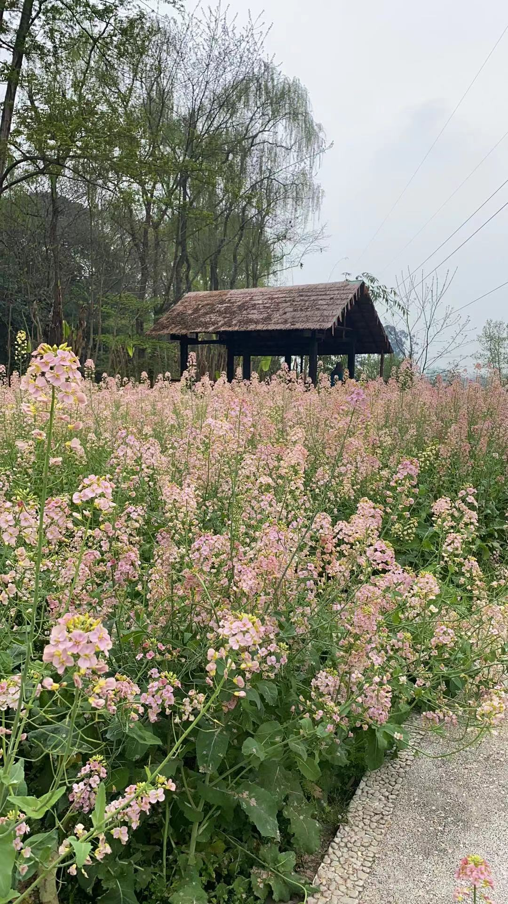</td>
  </tr>
</table>

看到这么幽静的竹林溪水，总让我幻想起那是，儿时外婆家旁的美好回忆。

<table>
  <tr>
    <td> 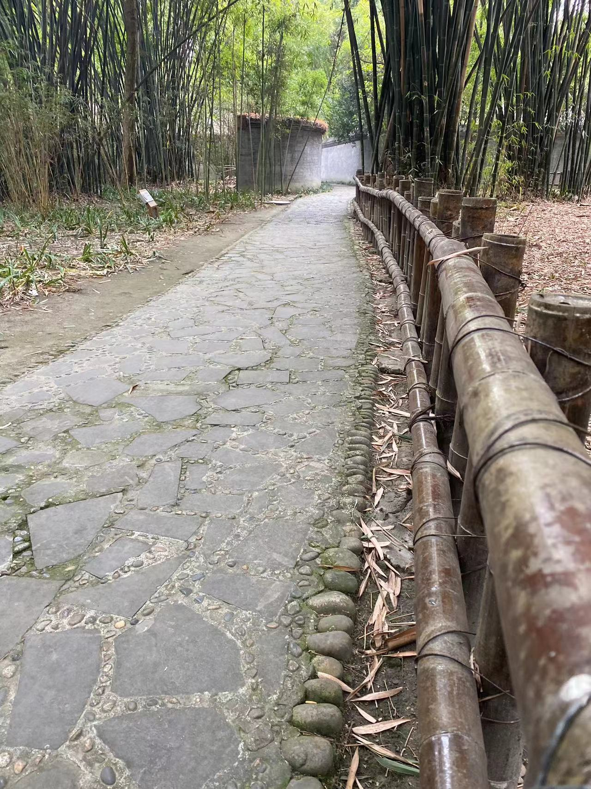</td>
    <td> 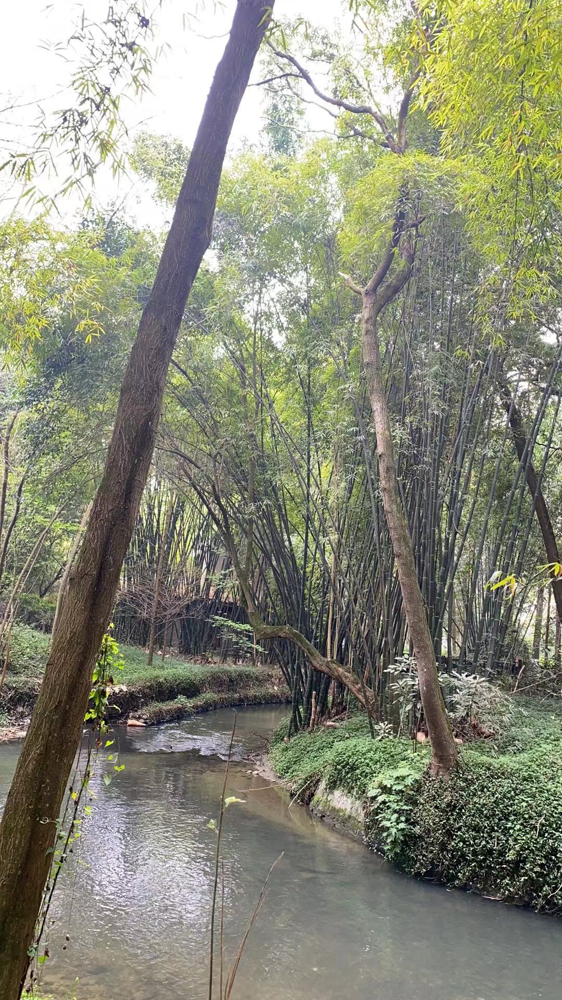</td>
    <td> 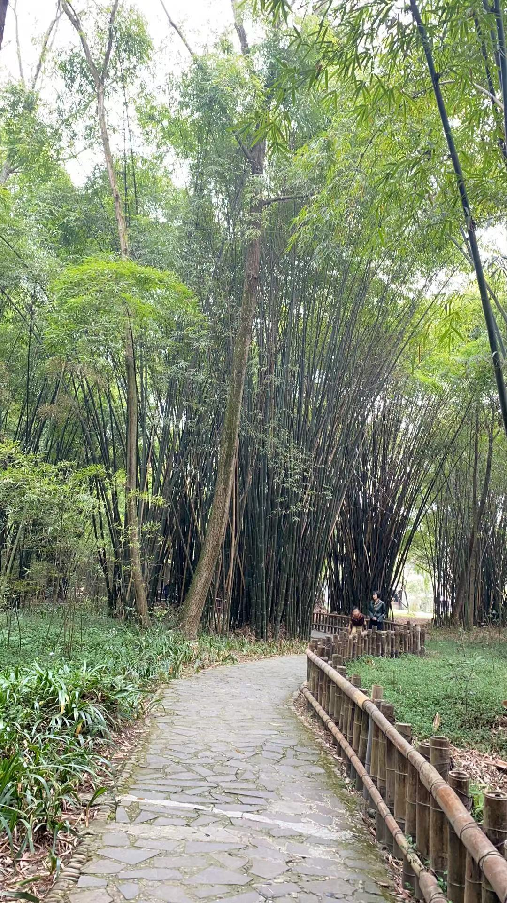</td>
  </tr>
</table>

看到这么平静的湖面，总让我心境毫无波澜，我离心如止水的境界又进了一步。哈哈😄！可是谁又可以告诉我，晚上老是睡不安稳又是为何？

<table>
  <tr>
    <td> 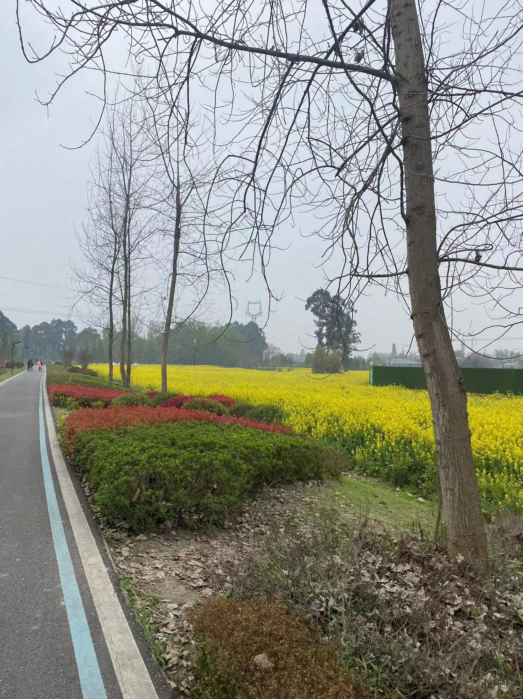</td>
    <td> 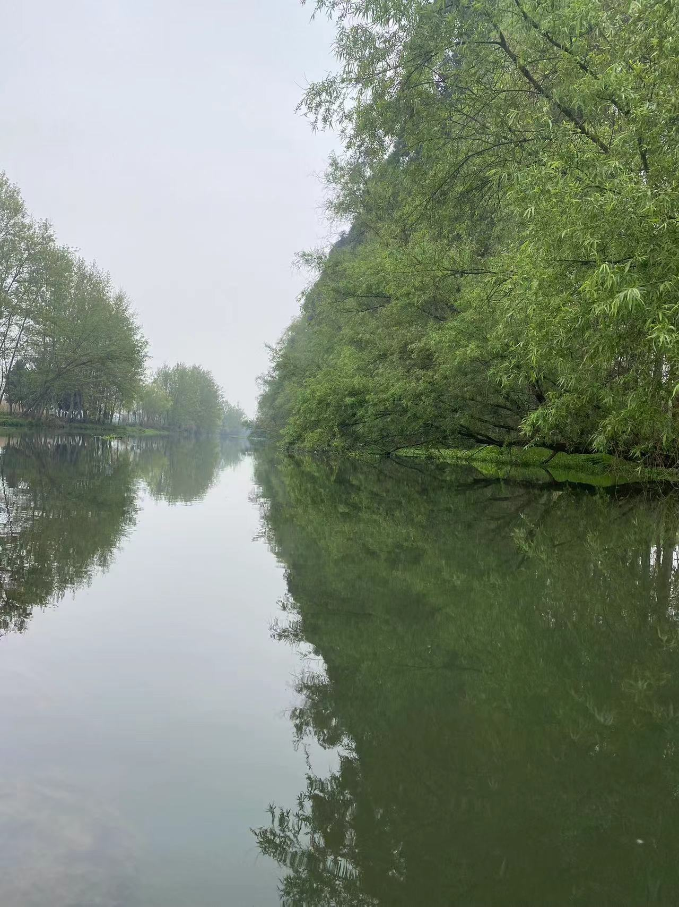</td>
  </tr>
</table>

你要是逛累了，抑或只想溜溜娃我想，大草坪是你最好的选择。其实一家人或几好友近郊露营，也是别样的悠闲吧。

<table>
  <tr>
    <td> 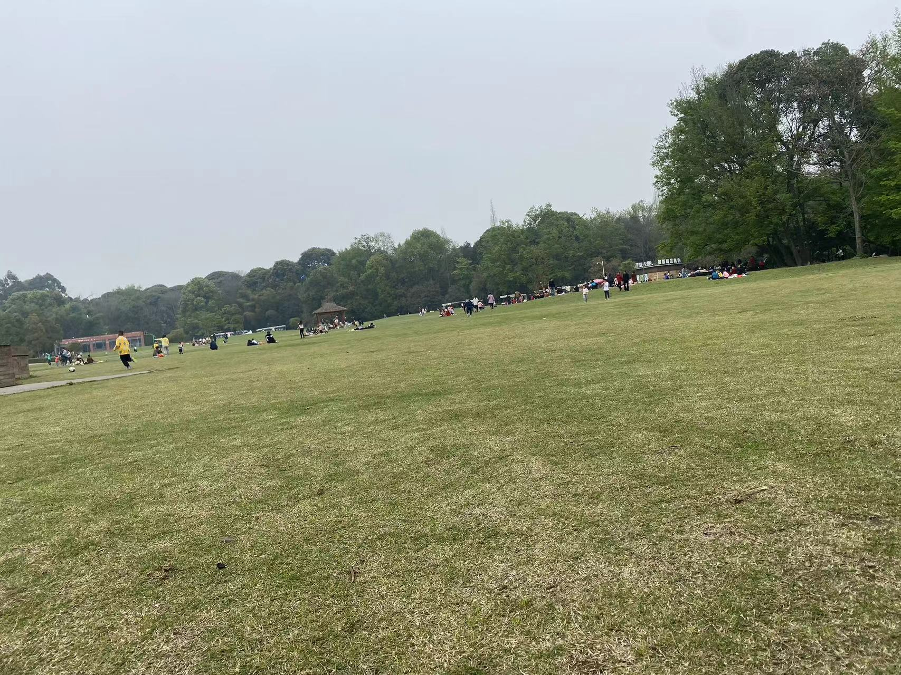</td>
    <td> 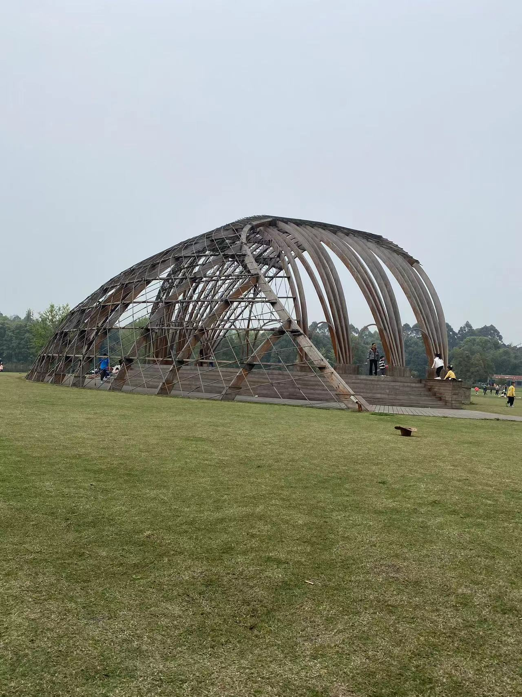</td>
  </tr>
</table>

## 崇州静翠园 - 龙泉枇杷沟

原计划是准备去崇州静翠园挖折耳根的，不得不说折耳根还是四川人的最爱；但天公不作美，一下高速雨就雨下大了，觉得没有必要再冒雨去找快乐😂，然后加完油就准备回去了，一个不是完美的周末。

就在回去的掉头的路口，车速没有控制好，被骂了一番😄。但是车的熟练度是上来了。

胆子还是可以，上周跑了一天，就熟悉了那么一下下，本周将就敢跑高速了，佩服我自己。其实并没有那么顺利，很久没有开车基本其实都忘记了，老是跑去看雨刮一只修方向盘，原本也没啥的，也能勉强在高速跑；但是下了点下雨，一开雨刮就像人失去了主心骨马上就不知所向；看来这样子是不得行的呢，只能靠应急让鬼子来了。然后自己缓解了一下情绪交流了一下心得，所以回来的时候自己上手还是蛮不错的。

回程的高速上，还是心有不甘，我们最后决定去龙泉阳光城，眼仔在那边说的没有下雨呢，刚好有段事件没见了。

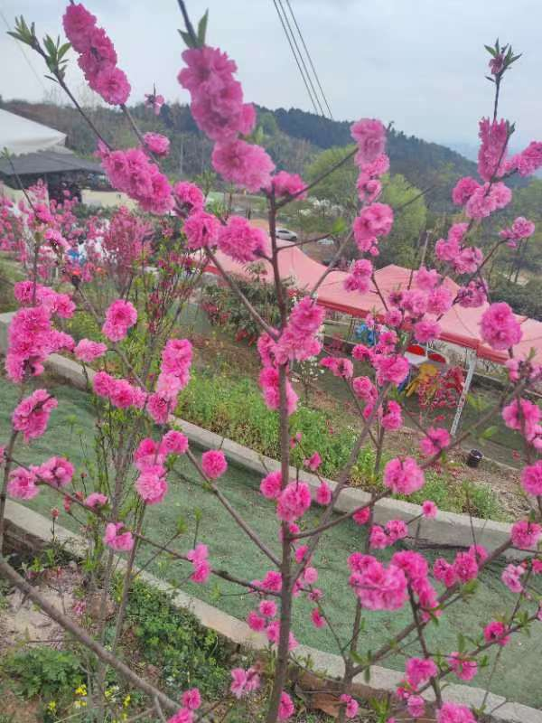

午饭后我们决定去了枇杷沟，抓了抓春天的尾巴，观赏了一下有是快谢的桃花。周末出游的人还是蛮多的呢，第一次开了这种山路，路还是比较宽阔，上山还是比较从容。

下山出了点小小的意外，出停车的小平台的时候，没有掌握好距离眼看出不去，想的是准备踩刹车停下来倒一下就好了，却错踩了油门；然后就硬出去了，还好是一个小木干，把后视镜的玻璃蹭掉了，也是把自己吓懵逼了。

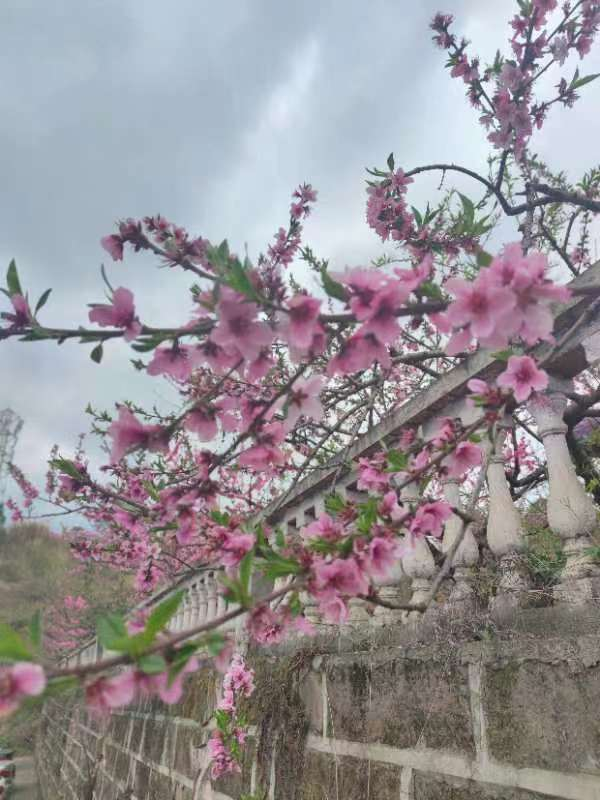

安上后视镜的镜片后的回程，心有余悸迟迟走不出那一幕，宝宝和鬼子也是吓得不浅的，一路上都是提心吊胆，自己把自己是累得不行；根据一次的过失想想，我觉得就像人生一样，那有没有过失呢，主要的是放下过失，这样自己就会轻松很多。

## 大邑云中屋

一直没有确定下目的地，昨晚鬼子说徒步点醒了我；但是挺多有意思的徒步路线，都是在西北的彭州和都江堰的方向，甚是觉得南门这边就不香了。

早上又看了一下，好像只有大邑相对来说要近点了，然后就在网上又看了一篇，最后确定去大邑的云中屋，距离90公里的一样子，徒步的路程1-2晓得样子，这样练车玩耍都能接受的呢。

还是双流北上高速，这次与上两次的练习，相对来说稳当多了，速度上来说也基本保持在110-130，非常不错的进步。

到大邑城区顺便见了以前的一个老友，吃过午饭寒暄了几句，继续上路到云中屋山脚也就下午1点的样子，时间来说还是很能接受的。

到达目的的先去河边悠转了一圈，跟大多数河边一样有鹅卵石还有河水😄，我想夏天这边戏水还是蛮不错的选择。

比起看水，我还是喜欢登高徒步，爬山没有登山棍是怎么行的呢，舍不得钱买那我们就自己搞一根路边别人砍好的吧。

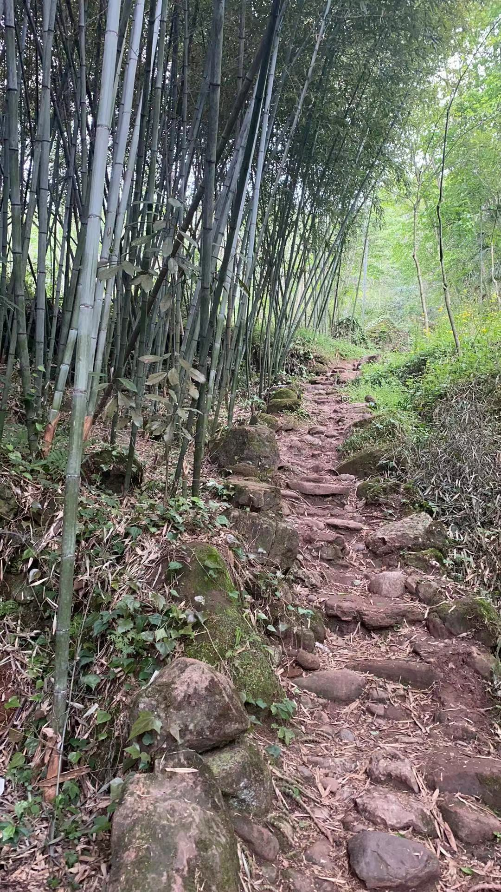

你说这种路没有登山棍行吗，特别是下山；在你上山基本就消耗差不多的体力时，下山有一个棍子很保护膝盖哟。

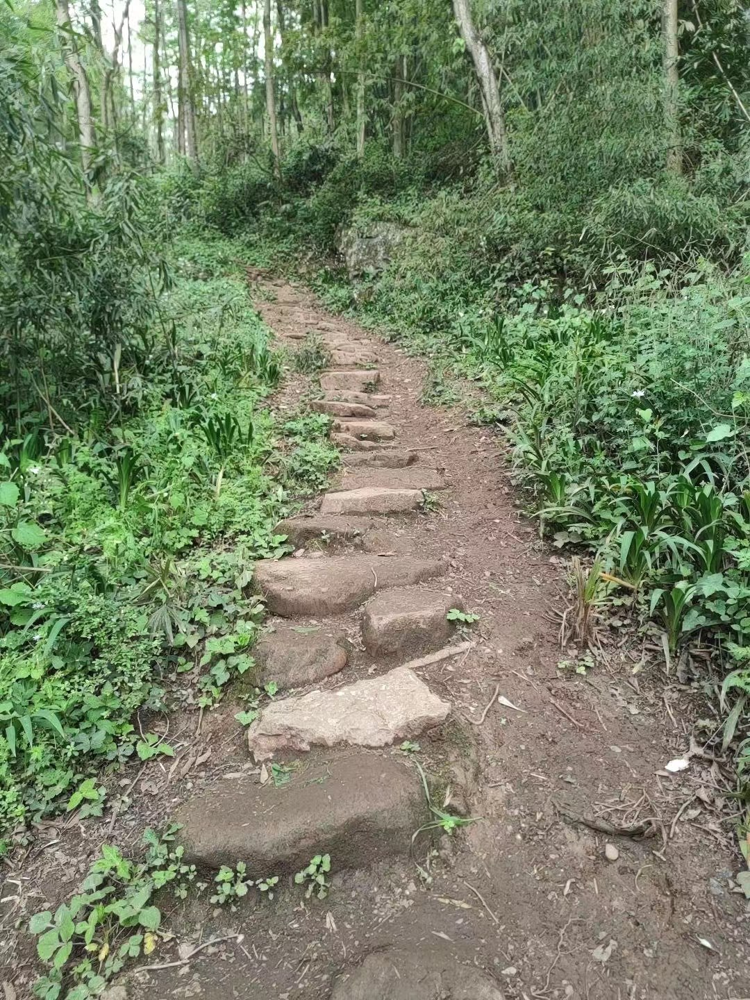

~~我在想为什么人都喜欢登山，登山那么累是为了看别样的风景，还是为了锻炼身体；也许是为了给疲惫的身体放个假，给空洞的灵魂包餐一顿。~~

<table>
  <tr>
    <td> 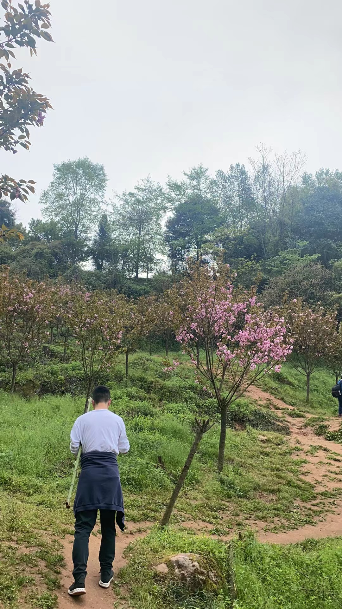</td>
    <td> 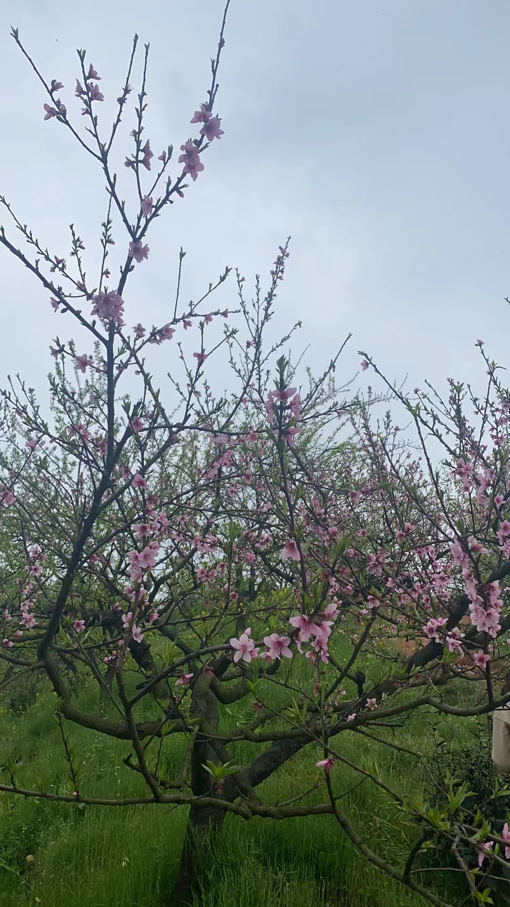</td>
    <td> 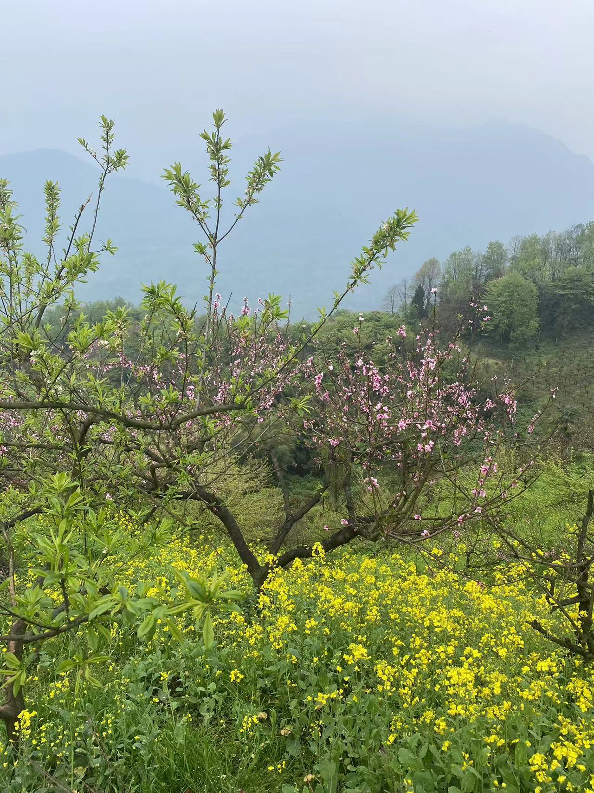</td>
  </tr>
</table>

不管怎样，只有自己去感受，我想这样才是最好的收获。

上周末在龙泉那边的挑花基本就快谢完了，在云中屋山上居然还有油菜花、桃花、梨子花、李子花（已谢）、木棉花等，真的是意外之喜。

<table>
  <tr>
    <td> 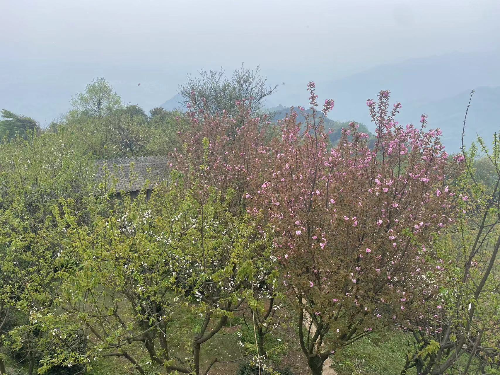</td>
    <td> 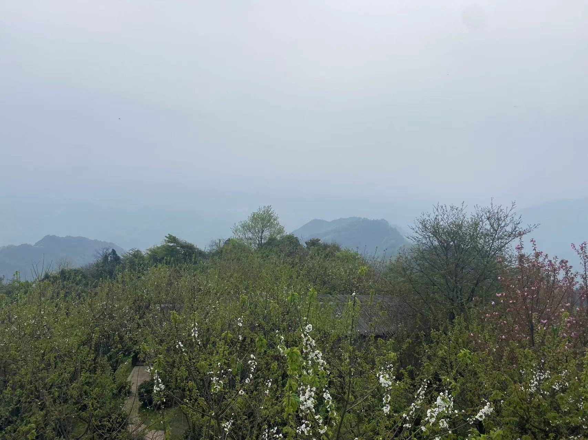</td>
  </tr>
</table>

其实最让佩服的还是一对老年夫妇，在我们快要登顶的时候碰到了他们；这个路程对于我来说就能接受了，他们胜过我们上山时遇到的两个年轻女孩，没有开始就退缩强太多了。现在的年轻人还是要好好锻炼身体。

<table>
  <tr>
    <td> 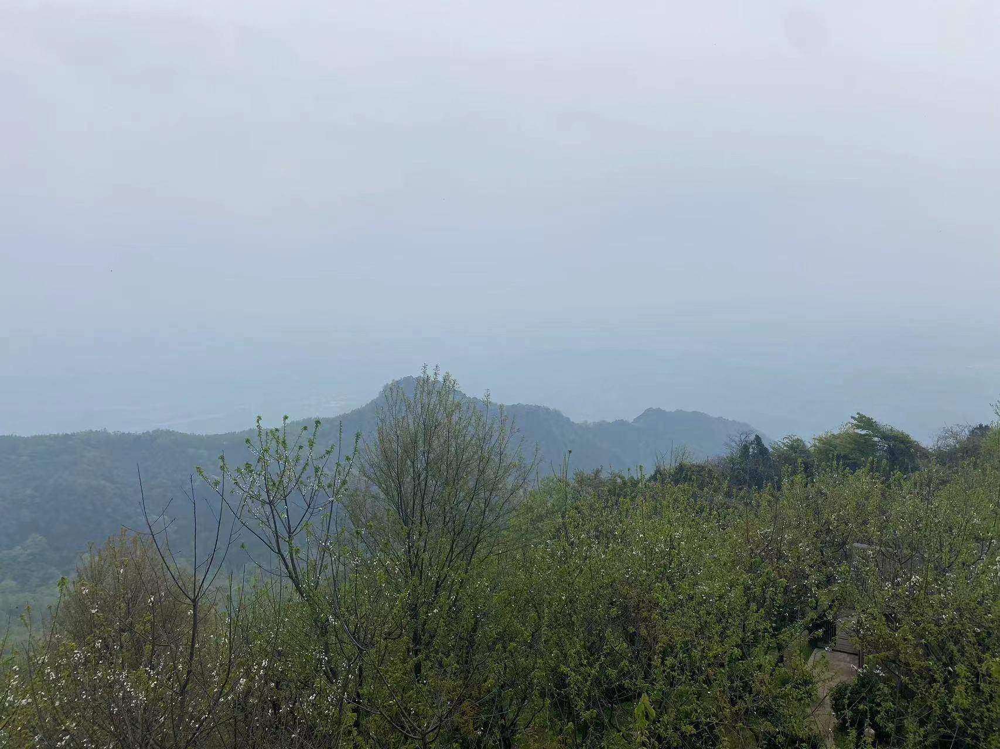</td>
    <td> 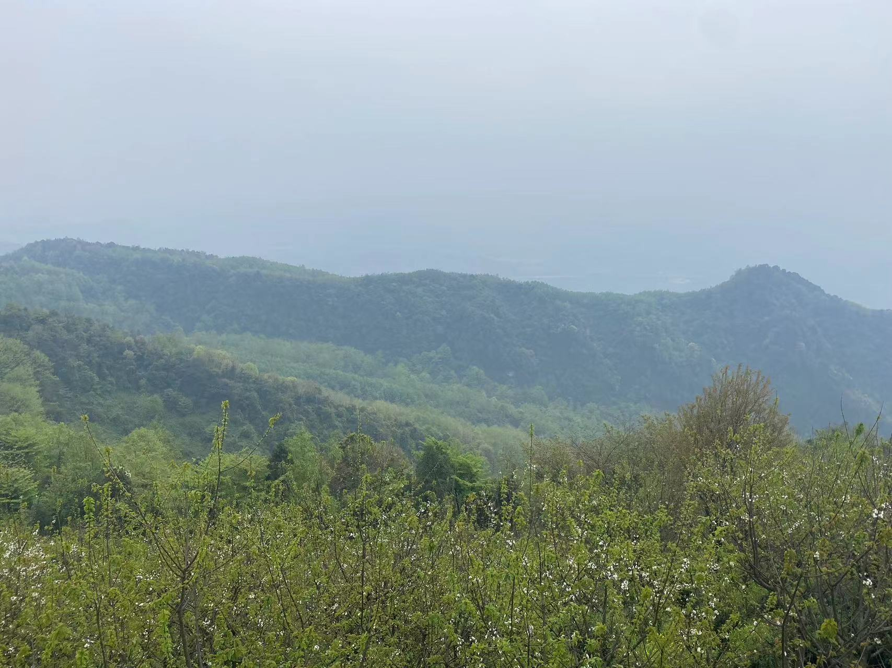</td>
  </tr>
</table>

登山我觉得意义有时候就是在挑战自己、挑战哪些不可能，有时候并不是自己不行，是自己觉得自己不行而已。其实还是要看你自己给自己如何的定位吧，我想只有心里信仰的人才会走得更远！

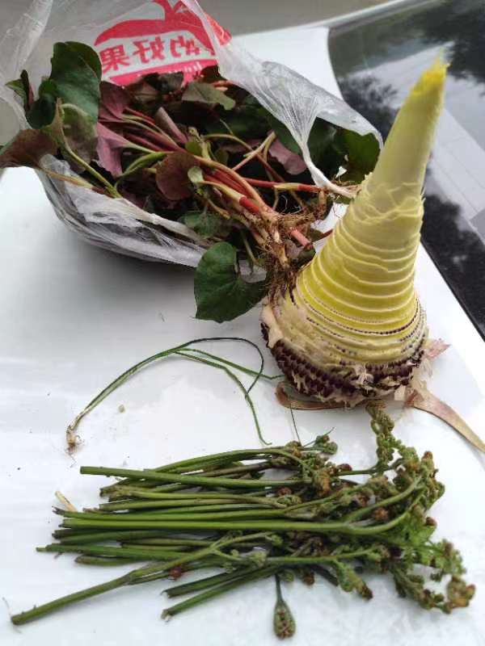

登顶有意外的收获，搞了点上次日程没有弄到的折耳根，还有返程路边弄到的竹笋，感谢大自然的馈赠😄！