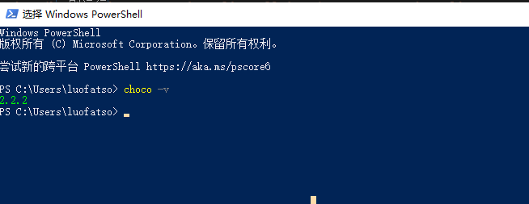

# Chocolatey -- windows包管理

## Chocolatey 是什么？

Chocolatey是一个用于Windows操作系统的包管理工具，它允许用户从命令行或图形用户界面安装、升级和卸载软件包。这些软件包可以包含应用程序、工具、库和其他软件组件，而Chocolatey可以简化这些软件的管理和维护过程。

## 官网安装

官网安装 [Chocolatey ](https://chocolatey.org/install) 供个人使用

- 使用 `PowerShell`，您必须确保`Get-ExecutionPolicy`不受限制。我们建议绕过 `Bypass` 该策略来安装东西或 `AllSigned` 获得更高的安全性。

运行 `Get-ExecutionPolicy`。如果返回`Restricted`，则运行`Set-ExecutionPolicy AllSignedor Set-ExecutionPolicy Bypass -Scope Process`。

- 准备就绪就运行以下命令安装 `Chocolatey `

```
Set-ExecutionPolicy Bypass -Scope Process -Force; [System.Net.ServicePointManager]::SecurityProtocol = [System.Net.ServicePointManager]::SecurityProtocol -bor 3072; iex ((New-Object System.Net.WebClient).DownloadString('https://community.chocolatey.org/install.ps1'))
```

- 查看是否成功

```
choco -v
```



## Chocolatey 的使用

- 查看帮助

```
# 查看Chocolatey自身的帮助信息

choco -?

# 查看Chocolatey子命令的帮助信息
# 例如: choco search -?
choco command -?
```

- 安装软件

```
choco install ndoejs
```

- 安装指定版本

```
choco install ndoejs --version x.y.z
```

- 查找软件

```
choco search nodejs
```

- 查找软件, 精确匹配软件名

```
choco search -e nodejs
```

- 查找所有可用版本

```
choco search --all -e nodejs
```

或者到[官方网站](https://community.chocolatey.org/packages)上去搜索可用版本

- 查看软件详细信息。

```
choco info nodejs
```

- 列出 `Windows` 系统已安装的软件

```
choco list -lo
```

- choco配置列表

```
choco config list
```

- 升级软件

```
choco upgrade git
```

- 卸载软件

```
choco uninstall git
```
