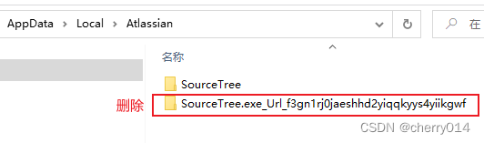
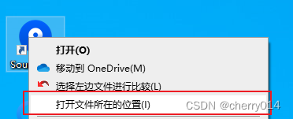

# Sourcetree

## 打不开、无法启动、闪退解决方法

有时候Sourcetree会突然出现打不开的情况，抑或打开的时候只出现弹框一两秒。后来网上搜索发现只要删除一个文件即可恢复，文件路径查找到删除的文件就可以直接运行了。

1. 文件位置：

```
C:\Users\admin\AppData\Local\Atlassian
```



2. 快速打开文件位置



后退文件夹到Local，然后找到Atlassian点进去，然后删除如下图的第二个文件夹即可
