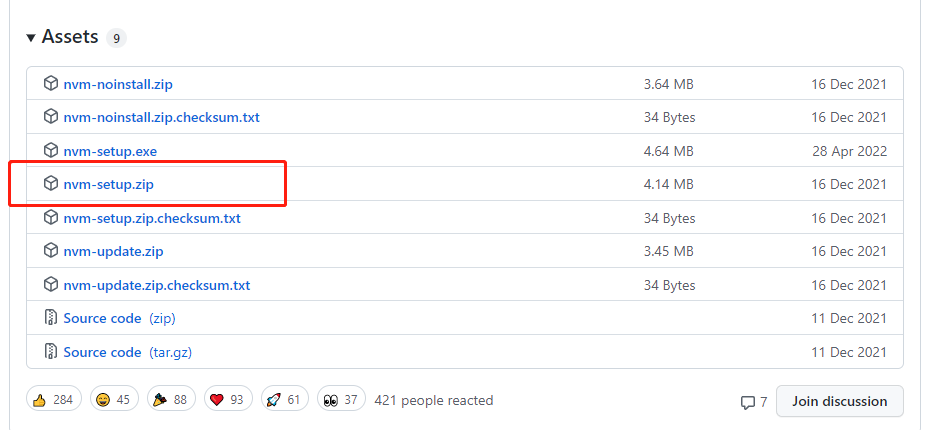

# nvm

## 什么是nvm

nvm 是一个node的版本管理工具，可以安装切换node版本。

## 安装

下载地址[下载exe文件](https://github.com/coreybutler/nvm-windows/releases)



成功后cmd `nvm version` 看看是否成功

## 安装、切换、查看、卸载node

```
nvm for windows是一个命令行工具，在控制台输入nvm,就可以看到它的命令用法。基本命令有：
 
nvm arch [32|64] ： 显示node是运行在32位还是64位模式。指定32或64来覆盖默认体系结构。
nvm install <version> [arch]： 该可以是node.js版本或最新稳定版本latest。（可选[arch]）指定安装32位或64位版本（默认为系统arch）。设置[arch]为all以安装32和64位版本。在命令后面添加--insecure ，可以绕过远端下载服务器的SSL验证。
nvm list [available]： 列出已经安装的node.js版本。可选的available，显示可下载版本的部分列表。这个命令可以简写为nvm ls [available]。
nvm on： 启用node.js版本管理。
nvm off： 禁用node.js版本管理(不卸载任何东西)
nvm proxy [url]： 设置用于下载的代理。留[url]空白，以查看当前的代理。设置[url]为none删除代理。
nvm node_mirror [url]：设置node镜像，默认为https://nodejs.org/dist/.。我建议设置为淘宝的镜像https://npm.taobao.org/mirrors/node/
nvm npm_mirror [url]：设置npm镜像，默认为https://github.com/npm/npm/archive/。我建议设置为淘宝的镜像https://npm.taobao.org/mirrors/npm/
nvm uninstall <version>： 卸载指定版本的nodejs。
nvm use [version] [arch]： 切换到使用指定的nodejs版本。可以指定32/64位[arch]。nvm use <arch>将继续使用所选版本，但根据提供的值切换到32/64位模式的<arch>
nvm root [path]： 设置 nvm 存储node.js不同版本的目录 ,如果未设置，将使用当前目录。
nvm version： 显示当前运行的nvm版本，可以简写为nvm v
常用实例
 
nvm list　　//查看目前已经安装的版本
nvm list available //显示可下载版本的部分列表
nvm install 10.15.0 //安装指定的版本的nodejs
nvm use 10.15.0 //使用指定版本的nodejs
npm install -g cnpm --registry=https://registry.npm.taobao.org  //使用淘宝镜像
注：将npm镜像改为淘宝的镜像，可以提高下载速度
```