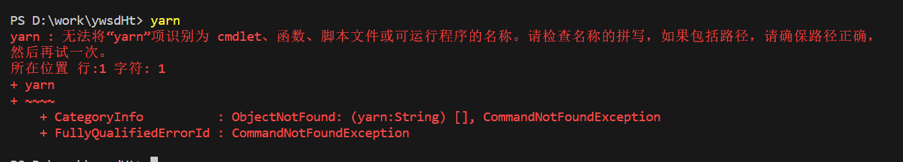
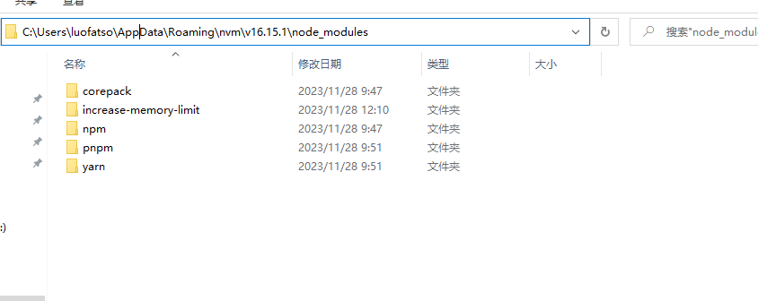

# yarn 相关

Yarn 是一个包管理器，同时也是项目管理器。多的话也不多说，反正你需要使用就行。

## 安装

- `node`方式

如果已经安装 `node` 可以使用 `npm` 快速安装

```
npm install -g yarn
```

## 禁止运行 `yarn`



`PowerShell` 执行策略，默认设置为 `Restricted` 不加载配置文件或运行脚本。需变更设置为 `RemoteSigned`，（简言之：因为电脑系统阻止了这个脚本的运行，对这个脚本不信任，所以我们要更改系统的权限）

- 改为 `cmd` 执行

最简单的解决方法是cmd代替powershell执行yarn命令

- 更改 `ExecutionPolicy`

管理员身份打开 `PowerShell`, 执行一下命令

```
set-ExecutionPolicy RemoteSigned
```

过程中提示询问是否要更改执行策略?，选择 A 或 Y 。完成后执行 `get-ExecutionPolicy` 命令，若返回`RemoteSigned `则表示成功。

::: warning 注意

1. 如果还是不行则先卸载，执行命令 `npm uninstall -g yarn` ，再重新安装 `npm i yarn -g` ， 再次查看版本检验是否正常。
2. 还有些情况比如说使用的是nvm控制nodejs的版本，下载的yarn包要放在对应nodejs版本的node_modules下面
   
   :::
